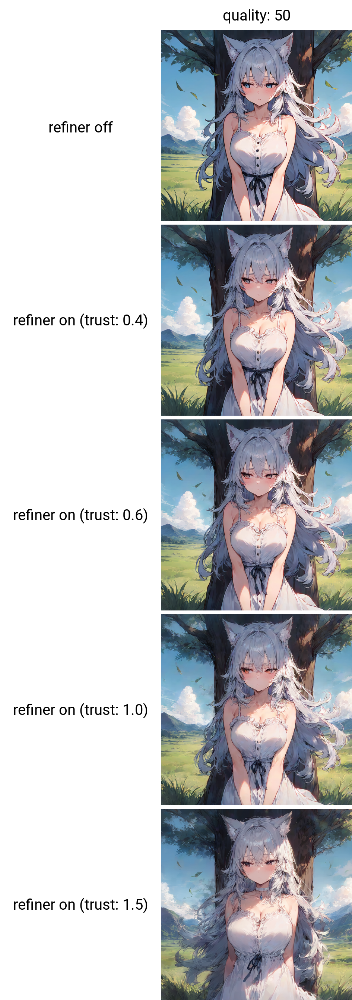

# ComfyUI-TeaCache

## Introduction
Timestep Embedding Aware Cache ([TeaCache](https://github.com/ali-vilab/TeaCache)) is a training-free caching approach that estimates and leverages the fluctuating differences among model outputs across timesteps, thereby accelerating the inference. TeaCache works well for Image Diffusion models, Video Diffusion Models, and Audio Diffusion Models.

TeaCache has now been integrated into ComfyUI and is compatible with the ComfyUI native nodes. ComfyUI-TeaCache is easy to use, simply connect the TeaCache node with the ComfyUI native nodes for seamless usage.

## Updates
- Aug 9 2026: Anima latent refiner checkpoint ships with the fork
    (`models/corrector-30m-96000.safetensors`, 30M params, 96K steps, K=1):
    - ~40% pooled v_t error recovery vs TeaCache base (K0 0.4384 → K1 0.2635),
      strongest on stale lags and early denoise steps; positive recovery in
      every (t-region × shape) cell, including the hardest late-t × 128x128
      corner.
    - Empirical usage limits: keep quality ≤ ~88 with the refiner on — above
      that TeaCache itself skips stability-critical steps and the output
      collapses. For simple/flat styles (hard shading, simple illustration,
      flat drawing) use Mode A; with `corrector_trust` > 0.75 the refiner
      drifts those toward realism/detail. Artist tags generalize beyond the
      40-tag training pool. Full eval grids and guidance in the Anima section.
- Aug 9 2026: `anima_presets.json` regenerated from the same 360-generation
    dataset the refiner was trained on (40 prompts × 3 seeds × 3 step-count
    variants, 512² / 1024² / 1024×512 mix) — fresh Pareto optimization run
    with measured step multipliers and per-control-point configs.
    New comparison grids: base (no TeaCache) + quality 10/40/80 × refiner
    off / on (trust 0.6) / on full, and a quality-40 trust sweep (off / 40% /
    60% / 100% / 150%) — all at 30 steps, euler_a, cfg 5.5; see the Anima
    section below.
- Aug 8 2026: corrector usability improvements:
    - `corrector_model` dropdown now resolves checkpoints from both the global
      `ComfyUI/models/teacache_correctors/` folder and the extension's
      `models/` folder (workflows store the bare filename, so they stay
      portable across machines).
    - The corrector group (corrector, corrector_model, refine_passes,
      corrector_trust) is now its own toggle group in the TeaCacheAnima UI
      instead of being hidden behind the overrides toggle.
- Aug 6 2026: opt-in latent corrector (Mode B′) for TeaCacheAnima:
    - Post-process TeaCache skip-step velocities with a trained latent model
      (`v_final = v_MA + trust·(v̂ − v_MA)`), driven by `corrector_model`,
      `refine_passes` and `corrector_trust`.
    - With a zero-initialized corrector, Mode B′ reproduces Mode A exactly,
      so the feature is safe to try at any time.
- Aug 5 2026: preset step/speedup estimates now use measured step-count
    threshold multipliers instead of the nominal steps ratio — the slider's
    reported speedup matches real generation runs.
- Jul 22 2026: TeaCacheAnima fixes and preset v1.5:
    - JS extension fixed for the new ComfyUI frontend (1.45+): widget value
      corruption from old workflow saves, override widgets not reaching the
      Python backend, and overrides hide-state not persisting on reload are
      fixed; copy/duplicate no longer crashes with NullGraphError.
    - anima_presets.json v1.5: quality range rebalanced (accumulated error
      0.01–0.06) — the top half of the slider previously sat in the noise
      floor.
    - torch.compile recompilation storms eliminated in the Anima and general
      TeaCache wrappers (no more stalls after the first generation).
- Jul 21 2026: quality slider overhaul and overrides:
    - The quality slider is now driven by auto-generated error-anchored
      presets from the measured Pareto frontier (power-law mapping with
      midpoint-aware threshold interpolation) — presets v1.1+.
    - Step count is auto-detected from sigmas — no manual steps input.
    - New collapsible overrides toggle with conditional sub-widgets
      (residual strategy, block mode, accumulation, step schedule).
    - New `per_group` runtime block mode (independent accumulators per block
      group).
    - Fix: TeaCache no longer affects generation when the node is disabled.
- Jul 13 2026: TeaCacheAnima + TeaCacheAnimaAdvanced nodes with quality
    slider — the first TeaCache support for Anima (Cosmos-Predict2-2B-Text2Image):
    - Quality 0–100 maps to a preset curve; the node's info string reports
      the estimated speedup and LPIPS for the current slider position.
- Jul 12 2026: this fork starts — TeaCache tuning toolkit for Anima
    (calibration, optimization and validation pipeline under `tuning/`).
- Jul 11 2025: ComfyUI-TeaCache supports FLUX-Kontext:
    - It can achieve a 1.5x lossless speedup and a 2x speedup without much visual quality degradation for FLUX-Kontext.
    - Support FLUX-Kontext LoRA!
- Jun 22 2025: ComfyUI-TeaCache supports HiDream-I1-Fast:
    - It can achieve a 1.4x lossless speedup and a 1.7x speedup without much visual quality degradation for HiDream-I1-Fast.
    - Support HiDream-I1-Fast LoRA!
- Jun 15 2025: ComfyUI-TeaCache supports HiDream-I1-Dev and Lumina-Image-2.0, adds cache_device option:
    - It can achieve a 1.5x lossless speedup and a 2x speedup without much visual quality degradation for HiDream-I1-Dev.
    - Support HiDream-I1-Dev LoRA!
    - It can achieve a 1.5x lossless speedup and a 1.7x speedup without much visual quality degradation for Lumina-Image-2.0.
    - Support Lumina-Image-2.0 LoRA!
    - Add cache_device option according to the feedback from [3](https://github.com/welltop-cn/ComfyUI-TeaCache/issues/74), [4](https://github.com/welltop-cn/ComfyUI-TeaCache/issues/104) and [5](https://github.com/welltop-cn/ComfyUI-TeaCache/issues/143).
- May 22 2025: ComfyUI-TeaCache supports HiDream-I1-Full and redesigns TeaCache options:
    - It can achieve a 1.5x lossless speedup and a 2x speedup without much visual quality degradation.
    - Support HiDream-I1-Full LoRA!
    - Add start_percent, end_percent options and remove max_skip_steps option according to the feedback from [1](https://github.com/welltop-cn/ComfyUI-TeaCache/issues/112) and [2](https://github.com/welltop-cn/ComfyUI-TeaCache/issues/84).
    - Fix compatibility issues to match the latest official ComfyUI version.
- Mar 26 2025: ComfyUI-TeaCache supports retention mode for Wan2.1 models and HunyuanVideo I2V v2 model:
    - Retention mode for Wan2.1 models can bring faster generation and better generation quality.
    - Fixes a bug about HunyuanVideo I2V v2 model.
- Mar 10 2025: ComfyUI-TeaCache adds max_skip_steps option and has made some changes for ease of use:
    - Add max_skip_steps option to enjoy a good trade-off between quality and speed for Wan2.1 models. The best settings are shown in the usage section.
    - Merge TeaCache For Img Gen and TeaCache For Vid Gen nodes into a single TeaCache node.
    - Fix compatibility issues about HunyuanVideo and LTX-Video to match the latest official ComfyUI version.
- Mar 6 2025: ComfyUI-TeaCache supports Wan2.1:
    - It can achieve a 1.5x lossless speedup and a 2x speedup without much visual quality degradation.
    - Support Text to Video and Image to Video!
- Jan 17 2025: ComfyUI-TeaCache supports CogVideoX:
    - It can achieve a 1.5x lossless speedup and a 2x speedup without much visual quality degradation.
    - Support Text to Video and Image to Video!
    - Note that TeaCache for CogVideoX node needs to be used with kijai's ComfyUI-CogVideoXWrapper nodes.
- Jan 15 2025: Thanks [@TangYanxin](https://github.com/TangYanxin), ComfyUI-TeaCache supports PuLID-FLUX and fixes bug about rel_l1_thresh:
    - It can achieve a 1.2x lossless speedup and a 1.7x speedup without much visual quality degradation.
    - Fixes a bug about rel_l1_thresh, when there are multiple TeaCache nodes in a workflow, the rel_l1_thresh value is always the value of the last TeaCache node.
- Jan 14 2025: ComfyUI-TeaCache supports Compile Model and fixes a bug that TeaCache keeps forever even if we remove/bypass the node:
    - Support Compile Model, now it can bring a faster inference when you add Compile Model node!
    - Fixes a bug related to usability, now we can go back to the workflow state without TeaCache if we remove/bypass TeaCache node.
- Jan 13 2025: Thanks [@TangYanxin](https://github.com/TangYanxin), ComfyUI-TeaCache remove the Steps setting from the node:
    - Now, it works fine even if there are multiple sampling nodes with different sampling steps in the workflow.
    - Fixes a bug, RuntimeError: The size of tensor a must match the size of tensor b at non-singleton dimension.
- Jan 10 2025: ComfyUI-TeaCache supports LTX-Video:
    - It can achieve a 1.4x lossless speedup and a 1.7x speedup without much visual quality degradation.
    - Support Text to Video and Image to Video!
- Jan 9 2025: ComfyUI-TeaCache supports HunyuanVideo:
    - It can achieve a 1.6x lossless speedup and a 2x speedup without much visual quality degradation.
- Jan 8 2025: ComfyUI-TeaCache supports FLUX:
    - It can achieve a 1.4x lossless speedup and a 2x speedup without much visual quality degradation.
    - Support FLUX LoRA!
    - Support FLUX ControlNet!

## Anima / Cosmos (this fork)

The `TeaCacheAnima` / `TeaCacheAnimaAdvanced` nodes add TeaCache for the
Anima (Cosmos-Predict2-2B-Text2Image) model. Besides the TeaCache knobs, both
nodes expose an optional **latent corrector** (Mode B′):

- `corrector = latent_denoiser` + a `corrector_model` selection enables it
  (`off` = standard Mode A, byte-for-byte unchanged; empty/missing model path
  falls back to Mode A with a warning);
- `refine_passes` (K, default 1) and `corrector_trust` (default 1.0) tune the
  correction strength: `v_final = v_MA + trust·(v̂ − v_MA)`;
- the info string shows `mode=B(K=…)` vs `mode=A`.

`corrector_model` is a dropdown populated from two locations: the global
`ComfyUI/models/teacache_correctors/` folder and the extension's own
`models/` directory. Corrector checkpoints are trained with the tuning
toolkit (`tuning/train_corrector.py`, see `tuning/README.md` — Latent-Space
Refiner section) and ship as `.safetensors` files — the training default
output is the extension's `models/` directory (e.g.
`models/corrector-20m.safetensors`), so freshly trained checkpoints appear
in the dropdown automatically. Drop files into either location and refresh
the node to pick them up; workflows store the bare filename, so they are
portable across machines. With a zero-initialized corrector, Mode B′
reproduces Mode A exactly, so the feature is safe to try at any time.

### Mode B′ — trained refiner (`corrector-30m-96000`)

A first trained checkpoint ships with this fork: **30M params, 96K steps**,
trained at K=1 only (no multi-K curriculum), Sophia (lr 4e-4), per-channel
normalization, and **per-stratum output heads** (one zero-init head per latent
area: 64x64, 64x128, 128x128). It is trained on anima-base-v1.0 outputs
recorded with `calibrate.py --refiner-data only` using the tuning prompt
corpus (`tuning/prompts/`). Keep `refine_passes = 1` (`K_recommended = 1`);
`corrector_trust = 1.0` is the trained regime.

The checkpoint is `models/corrector-30m-96000.safetensors` (~60 MB) and shows
up in the `corrector_model` dropdown automatically.

#### Data collection (preset + refiner corpus)

Both the current `anima_presets.json` and the trained refiner come from the
same 360-generation calibration run (`tuning/config.json`):

- **360 generations** = 40 prompts (semantic-diversity selection from
  `prompts/calibration.json`) × 3 seeds (42, 267454, 123) × 3 step-count
  variants (15 / 30 / 45, weighted 0.15 / 0.70 / 0.15);
- resolution mix 512×512 (75%) / 1024×1024 (15%) / 1024×512 (10%);
- sampling variety: cfg 4.0–5.5, samplers `er_sde` / `dpmpp_2m_sde` /
  `euler_a`, schedulers `normal` / `simple`;
- refiner recording on **both CFG slots**, ladder lags [1, 2, 3, 4, 8, 16],
  bfloat16, all generations kept (no top-N pruning), 6 eval prompts;
- artist-tag injection: 40-tag pool, max 1 tag per prompt, relative weights;
- **17 GB of refiner training data** in total (lossless blosc2 latents).

The refiner was trained on this corpus with the effective config snapshotted
into the checkpoint: `--model-size 30m --max-steps 96000` (30,043,984 params
achieved), multipass off (K=1), Sophia (lr 4e-4, ρ=0.04, wd 0.05, hessian
every 10 steps on half the batch), rel-MSE loss with lag weights
[2.5, 1.5, 1.0, 0.5, 0.25, 0.125], per-channel normalization (128 samples),
de-burst window batching (64 runs), lag/res conditioning, bucket weights
64x64 1.0 / 64x128 1.25 / 128x128 2.0, and a stationary resolution mix (no
curriculum). Eval every 8k steps; a 500-step beacon with LR control (0.5×
factor, 2e-5 floor) picks the best checkpoint.

#### Training stats

9h 24m wall (train 8h 56m), 8.76 it/s (median step 114 ms), VRAM peak
11.9 GB, final loss 0.08968 (EMA 0.07911, min 0.00239). Best ladder-only
K1 = 0.2816 @ step 72000; the final 96k eval lands right on it (0.2823).

#### Eval grids (fixed held-out eval, step 96000)

K0 = Mode A (no correction), K1 = one refine pass; recovery = 1 − K1/K0.

Per-lag (pooled over t and shape):

| lag d | K0 | K1 | recovered |
|:------:|:----:|:----:|:----------:|
| 0 (fresh anchor, diagnostic*) | 0.0000 | 0.0703 | — |
| 1 | 0.3270 | 0.1910 | +41.6% |
| 2 | 0.4093 | 0.2280 | +44.3% |
| 4 | 0.5143 | 0.2866 | +44.3% |
| 8 | 0.6395 | 0.3646 | +43.0% |
| 16 | 0.7404 | 0.4402 | +40.5% |
| pooled | 0.4384 | 0.2635 | +39.9% |

\* The lag-0 row is the d=0-anchor diagnostic: the corrector is never trained
on fresh anchors, so a small K1 perturbation there is expected and harmless.

Per shape (pooled over t and lag; recoveries marked † are derived from the
K0/K1 columns):

| shape | K0 | K1 | recovered |
|:------:|:----:|:----:|:----------:|
| 64x64 | 0.3970 | 0.2413 | +39.2% † |
| 64x128 | 0.4241 | 0.2298 | +45.8% † |
| 128x128 | 0.2795 | 0.1868 | +33.2% † |

Recovery per t-region (ladder-only, anchors excluded): early +56.7%,
mid +49.9%, late +28.0% — the refiner pays for itself almost exclusively
during the high-noise half of the denoise.

K1 × lag, sliced by t-region (recovery vs. that cell's K0 in parens):

| t region | d=1 | d=2 | d=4 | d=8 | d=16 |
|:--------:|:----:|:----:|:----:|:----:|:----:|
| early | 0.1947 (+58.3%) | 0.2333 (+57.8%) | 0.2918 (+56.0%) | 0.3619 (+53.0%) | — |
| mid | 0.1249 (+44.4%) | 0.1648 (+50.3%) | 0.2208 (+51.5%) | 0.3019 (+50.7%) | 0.3977 (+49.8%) |
| late | 0.2519 (+16.5%) | 0.2821 (+22.8%) | 0.3493 (+28.5%) | 0.4248 (+32.2%) | 0.4723 (+32.7%) |

K1 × shape, sliced by t-region:

| t region | 64x64 | 64x128 | 128x128 |
|:--------:|:-----:|:------:|:-------:|
| early | 0.1989 (+52.1%) | 0.2067 (+52.4%) | 0.1979 (+49.6%) |
| mid | 0.1973 (+47.0%) | 0.1874 (+56.0%) | 0.1463 (+46.6%) |
| late | 0.3101 (+24.2%) | 0.2746 (+34.1%) | 0.2098 (+11.4%) |

v_t error recovery vs TeaCache base (pooled rel-MSE ‖v̂−v_true‖₂/‖v_true‖₂):

| method | abs err | × base | recovered |
|:-------|:-------:|:------:|:---------:|
| TeaCache base (K=0) | 0.39465 | 1.000 | — |
| — ladder only | 0.49424 | 1.000 | — |
| Corrector K=1 | 0.23959 | 0.607 | +39.3% |
| — ladder only | 0.28230 | 0.571* | +42.9%* |
| — d=0 anchors only | 0.07033 | — | — |
| Per-channel affine (OOD) | 0.86496 | 2.192 | −119.2% |
| — ladder only | 0.87403 | 1.768* | −76.8%* |
| Oracle (v_true) | 0.00000 | 0.000 | 100.0% |

\* vs. the ladder-only base row (0.49424). The affine rows are the
linear-predictability ceiling: a per-channel affine corrector fit on train
pairs **degrades** eval pairs (OOD, −119.2%), and the per-stratum fits are
near-identity (64x64 rel 0.8984, 64x128 rel 0.6733, 128x128 rel 0.8831 with
|a−1| ≤ 0.98, |b| ≤ 0.003) — the corrector's value is its nonlinearity, which
is exactly what a linear baseline cannot ship.

#### Deployment findings

1. **Quality ceiling ≈ 86–88.** The TeaCache + refiner pipeline holds up to a
   quality slider of ~86–88. Beyond that, TeaCache itself starts skipping
   steps that are integral to image stability and the output devolves into
   chaos immediately — this is a TeaCache step-skipping failure, not a
   corrector failure, and no trust setting fixes it. Keep quality ≤ ~88 when
   the refiner is enabled.
2. **Realism / detail drift.** The correction profile leans toward realistic,
   high-detail output — most visible on detail-heavy subjects, especially
   hair. This is attributed mainly to the default prompt selection of the
   training corpus (`tuning/prompts/`, skewing to detailed character prompts);
   re-recording with a different corpus (`calibrate.py --refiner-data only`)
   shifts the bias. If output drifts too realistic for the intended look,
   lower `corrector_trust` (e.g. 0.5–0.75).
3. **Artist tags generalize.** Despite a small training pool (40 tags, mostly
   unweighted), the refiner behaves well with artist tags it never saw,
   including styles outside the general style of the trained tags — latent
   correction is effectively style-agnostic in practice.
4. **Trust > 0.75 abandons simple styles.** With `corrector_trust` above 0.75,
   the refiner increasingly ignores simplistic styles — prompts like
   *hard shading*, *simple illustration*, *flat drawing* devolve into a more
   realistic, detailed image, while the base model keeps pushing simpler:
   a destructive cycle that produces a bad, realistic output (the worst of
   both sides). For simple/flat styles, leave the refiner off (`corrector =
   off`); base TeaCache is already sufficient there.

Quick settings table:

| Scenario | Setting |
|---|---|
| Default character / detailed stylized art, quality ≤ 88 | Mode B′, K=1, trust 1.0 |
| Quality > 88 (aggressive speedup) | Refiner won't help — cap at ~88 |
| Realism-leaning or hair/detail-heavy prompts | Mode B′ with trust 0.5–0.75 |
| Simple / flat / hard-shading styles | `corrector = off` (Mode A) |
| Any artist tag (trained or not) | Mode B′ behaves consistently |

#### Result comparison

- 
<strong>Anima — base (no TeaCache) + quality 10 / 40 / 80 × refiner off / on (trust 0.6) / on full (30 steps, euler_a, cfg 5.5)</strong>

- 
<strong>Anima — quality 40, corrector trust sweep (off / 40% / 60% / 100% / 150%; 30 steps, euler_a, cfg 5.5)</strong>

#### Current limitations & outlook

An honest assessment from testing the 30M refiner:

- **Strong at high skip rates (quality 70–88).** Where base TeaCache starts
  to break down, the refiner's higher-lag recovery keeps the output
  considerably better — this is the regime where the current model earns its
  place.
- **Detail bias at lower skip rates.** The refiner leans heavily toward more
  detail, which at 30M parameters is suspected to stem partly from training
  data bias. With its limited size that bias often produces output worse than
  no refiner at all, even at low trust levels: an over-detailed image that
  never gets the steps it would need to make that detail look good, reading
  as grainy and blurry rather than high-detail.
- **Capacity / training ceiling.** The model currently lacks the training or
  the capacity to properly correct and reconstruct the latent output in a way
  that meaningfully improves results at lower skip rates.

The path forward is larger and better-trained: increasing the model to 50M+
parameters, along with tweaks to training methods and configs aimed at less
biased, more balanced recovery — so the image doesn't get muddied as much.
If a recovery of ~70% or higher is achieved, qualities around 50–70 could
become near-imperceptible vs. base TeaCache while being 2–3× faster.

## Installation
Installation via ComfyUI-Manager is preferred. Simply search for ComfyUI-TeaCache in the list of nodes and click install.
### Manual installation
1. Go to comfyUI custom_nodes folder, `ComfyUI/custom_nodes/`
2. git clone https://github.com/welltop-cn/ComfyUI-TeaCache.git
3. Go to ComfyUI-TeaCache folder, `cd ComfyUI-TeaCache/`
4. pip install -r requirements.txt

## Usage
### TeaCache
To use TeaCache node, simply add `TeaCache` node to your workflow after `Load Diffusion Model` node or `Load LoRA` node (if you need LoRA). Generally, TeaCache can achieve a speedup of 1.5x to 3x with acceptable visual quality loss. The following table gives the recommended rel_l1_thresh, start_percent and end_percent ​for different models:

| Models                       |   rel_l1_thresh   |    start_percent  |     end_percent   |      speedup      |
|:----------------------------:|:-----------------:|:-----------------:|:-----------------:|:-----------------:|
| FLUX                         |        0.4        |         0         |         1         |        ~2x        |
| PuLID-FLUX                   |        0.4        |         0         |         1         |        ~1.7x      |
| FLUX-Kontext                 |        0.22       |         0.2       |         0.9       |        ~2x        |
| HiDream-I1-Full              |        0.35       |         0.1       |         1         |        ~2x        |
| HiDream-I1-Dev               |        1          |         0         |         1         |        ~2x        |
| HiDream-I1-Fast              |        1.5        |         0         |         0.9       |        ~1.7x      |
| Lumina-Image-2.0             |        0.38       |         0.2       |         1         |        ~1.7x      |
| HunyuanVideo                 |        0.15       |         0         |         1         |        ~1.9x      |
| LTX-Video                    |        0.06       |         0         |         1         |        ~1.7x      |
| CogVideoX                    |        0.3        |         0         |         1         |        ~2x        |
| Wan2.1-T2V-1.3B              |        0.08       |         0         |         1         |        ~1.6x      |
| Wan2.1-T2V-14B               |        0.2        |         0         |         1         |        ~1.8x      |
| Wan2.1-I2V-480P-14B          |        0.26       |         0         |         1         |        ~1.9x      |
| Wan2.1-I2V-720P-14B          |        0.25       |         0         |         1         |        ~1.6x      |
| Wan2.1-T2V-1.3B-ret-mode     |        0.15       |         0.1       |         1         |        ~2.2x      |
| Wan2.1-T2V-14B-ret-mode      |        0.2        |         0.1       |         1         |        ~2.1x      |
| Wan2.1-I2V-480P-14B-ret-mode |        0.3        |         0.1       |         1         |        ~2.3x      |
| Wan2.1-I2V-720P-14B-ret-mode |        0.3        |         0.1       |         1         |        ~2x        |

If the image/video after applying TeaCache is of low quality, please reduce rel_l1_thresh. I really don't recommend adjusting start_percent and end_percent unless you are an experienced engineer or creator.

If you have enough VRAM, please select `cuda` in the `cache_device` option, which can bring faster inference, but will increase VRAM slightly. If you have limited VRAM, please select `cpu` in the `cache_device` option, which do not increase VRAM, but will make inference slower slightly.

The demo workflows ([flux](./examples/flux.json), [pulid_flux](./examples/pulid_flux.json), [flux_kontext](./examples/flux_kontext.json), [hidream_i1_full](./examples/hidream_i1_full.json), [hidream_i1_dev](./examples/hidream_i1_dev.json), [hidream_i1_fast](./examples/hidream_i1_fast.json), [lumina_image_2](./examples/lumina_image_2.json), [hunyuanvideo](./examples/hunyuanvideo.json), [ltx_video](./examples/ltx_video.json), [cogvideox](./examples/cogvideox.json), [wan2.1_t2v](./examples/wan2.1_t2v.json) and [wan2.1_i2v](./examples/wan2.1_i2v.json)) are placed in examples folder.

### Compile Model
To use Compile Model node, simply add `Compile Model` node to your workflow after `Load Diffusion Model` node or `TeaCache` node. Compile Model uses `torch.compile` to enhance the model performance by compiling model into more efficient intermediate representations (IRs). This compilation process leverages backend compilers to generate optimized code, which can significantly speed up inference. The compilation may take long time when you run the workflow at first, but once it is compiled, inference is extremely fast. The usage is shown below:

## Result comparison
- 
<strong>FLUX</strong>

- 
<strong>PuLID-FLUX</strong>

- 
<strong>FLUX-Kontext</strong>

- 
<strong>HiDream-I1-Full</strong>

- 
<strong>HiDream-I1-Dev</strong>

- 
<strong>HiDream-I1-Fast</strong>

- 
<strong>Lumina-Image-2.0</strong>

- 
<strong>HunyuanVideo</strong>

https://github.com/user-attachments/assets/b3aca64d-c2ae-440c-a362-f3a7b6c633e0

- 
<strong>LTX-Video</strong>

https://github.com/user-attachments/assets/8fce9b48-2243-46f1-b411-80e4a53f6f7d

- 
<strong>CogVideoX</strong>

https://github.com/user-attachments/assets/de8f5400-e885-446d-936f-c026a78ba5c2

- 
<strong>Wan2.1-T2V</strong>

https://github.com/user-attachments/assets/8a84a862-1947-4ba8-8298-047d50d8f670

- 
<strong>Wan2.1-I2V</strong>

https://github.com/user-attachments/assets/0ed5c2c6-b749-41cb-9e2b-e152ecd6c7c1

## Acknowledgments
Thanks to TeaCache repo owner [ali-vilab/TeaCache: Timestep Embedding Tells: It's Time to Cache for Video Diffusion Model](https://github.com/ali-vilab/TeaCache)
