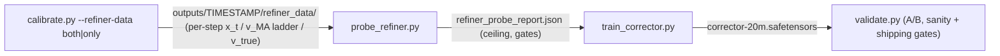

# Understanding the Refiner Probe

A guided tour of `probe_refiner.py` — what it measures, why, and how to read its
output. The whole document is anchored to one real run (the `outputs/20260806-162941`
probe), reproduced below; every number in it is decoded somewhere in this file.

---

## 1. Why this probe exists

This repo adds TeaCache skip-step acceleration to **Anima** — Lightricks'
release of NVIDIA's **Cosmos-Predict2-2B-Text2Image**, a ~2B-parameter diffusion
transformer (DiT) that generates images by denoising a 16-channel VAE latent
(8× downsampled; a 512² image lives on a 64×64 latent grid). The checkpoint
`anima-base-v1.0.safetensors` is loaded via ComfyUI; the model is distributed
under the (gated) NVIDIA Open Model License. See `nodes.py` and
`tuning/forward.py` for the inference-side integration.

**TeaCache's trick.** At each of the ~30 denoising steps the model outputs a
*velocity* `v` — a 16-channel field that tells the sampler how to update the
latent. Computing `v_true` (the exact velocity) is the expensive part. TeaCache
skips the model call on some steps and instead rebuilds a cheap guess, `v_MA`,
from a ring buffer of *old* residual activations. The guess is stale: it was
built from information that is `d` steps old (the **lag**).

**Mode B′ (the refiner).** Skipping is only worth it if the staleness error is
small — and the probe shows it is not. So the plan is to train a small neural
network (the **corrector**) that predicts the error from cheap inputs, then
apply it on skip steps:

```
v_final = v_MA + trust · Δv̂          (trust ∈ [0,1], from the preset config)
```

Because the corrector's output head is zero-initialized, `Δv̂ = 0` at start and
Mode B′ is byte-for-byte identical to Mode A (current shipped behavior) until
training kicks in. A corrector that never learns can never make things worse.

**The pipeline** (`tuning/README.md` §71):



The probe is the **feasibility study** that sits between data recording and full
training. Its job is to answer, cheaply:

1. Is the skip error real? *(t-gap cancellation)*
2. Is the error learnable? By a linear map? By a small neural net? *(SVD,
   affine ceiling, Day-1 experiment)*
3. Is staleness a *decodable* signal? *(staleness curve, lag-readability)*
4. Should we spend on the full corrector? *(decision gate + Day-1 verdict)*

It is designed to catch hopeless ideas before ~60k training steps, and it costs
~2 minutes of wall time and 0.3 GB of VRAM on a pre-recorded corpus.

---

## 2. The recorded data

Recording (`calibrate.py --refiner-data`, plan Task 2) runs the *full* model on
every step — no TeaCache decisions — and captures, per step, per CFG slot
(classifier-free guidance runs the model twice: with and without prompt):

| Tensor | What it is | Notes |
|---|---|---|
| `x_t` | the 16-channel latent input to the model at step t | the corrector's main input |
| `v_true` | the **true** velocity — the exact full-model output at step t | stored once per step, serves all lags |
| `v_MA_d` | the **Mode-A skip reconstruction** at lag d | built from the residual ring buffer — bit-for-bit the deployment skip construction: `v_MA(d) = unpatchify(final_layer(ori_x + Δr_{t−d}, t))` |
| `Δ_MA` | `v_true − v_MA_d`, the staleness error | *derived at load, not stored* — exact, no accumulation chains |

Key storage facts (`tuning/refiner_data.py`):

- The **d=0 anchor** (`v_MA(0) = v_true`, `Δ = 0`) is synthesized at load —
  zero disk cost, and it teaches the corrector the "do nothing" case.
- Ladder of lags: `1, 2, 4, 8, 16` (config `refiner.record_lags`).
- Lossless blosc2 bitshuffle+zstd (clevel 9), bf16 tensors; raw/zfpy fallbacks.
- ≈ **27 MB per generation** at 512² (both slots): per step per slot `x_t`
  107 KB + 5×`v_MA` 51 KB + `v_true` 51 KB + prompt embeddings.
  ≈ 3.8 GB per 140 gens, ≈ 9.9 GB per 360 gens (all 512²).
- The ring buffer itself lives on GPU during recording: ~128–256 MB.

**The corpus shapes.** The example run analyzed **360 generations** at three
latent resolutions — `64×64` (512² images), `64×128` (512×1024), `128×128`
(1024²) — matching the config's `resolution_mix` (512² 75%, 1024² 15%,
1024×512 10%). The probe's own recorder only writes 3–5 generations
(`record_probe_generations` clamps `--prompts` to 2–5); a 360-gen corpus comes
from `calibrate.py --refiner-data` with `keep_all: true` / `top_n: -1`.
The example run was **analysis-only** (`--data`), which is why its VRAM peak is
only 0.3 GB — no large model was loaded; the tiny UNet and dataset cache are
the only CUDA allocations.

---

## 3. The example run (verbatim)

```
============================================================
  Refiner Probe
============================================================
  Data: outputs/20260806-162941/refiner_data
  Loading generations and collecting tensors/stats (8 analysis thread(s))...
  Generations: 360  tensors: {'x_t': 12, 'v_true': 12, 'v_ma': 12, 'delta': 12}

  t-gap cancellation: |Δ_MA|=0.421336 vs |v_true(t)−v_true(t−1)|=0.269538 → ratio 1.563 (<1 confirms the t-gap cancels)

  SVD rank(95%): 128x128=16  64x128=16  64x64=16
  Affine ceiling (1−R²): 128x128=0.5995  64x128=0.5213  64x64=0.6584
  Staleness monotone: True
  Decision gate (64x64): RECONSIDER
      staleness region 0: d1=0.4984  d2=0.5933  d4=0.7398
      staleness region 1: d1=0.2903  d2=0.4153  d4=0.6438

  Day-1 experiment (MLP → tiny UNet, plan 3d)...
  Day-1 MLP (pooled features) mean-Δ error: 0.13583
  [day1] step    1/600  loss=0.76236 (ema 0.76236, min 0.76236)  it/s=1.32  elapsed=1s
  [day1] step   50/600  loss=0.96917 (ema 0.75070, min 0.00108)  it/s=36.20  elapsed=2s
  [day1] step  100/600  loss=0.53959 (ema 0.68741, min 0.00108)  it/s=37.43  elapsed=4s
  [day1] step  150/600  loss=0.90354 (ema 0.63421, min 0.00108)  it/s=38.25  elapsed=6s
  [day1] step  200/600  loss=0.18460 (ema 0.58980, min 0.00108)  it/s=39.03  elapsed=7s
  [day1] step  250/600  loss=0.01028 (ema 0.40379, min 0.00108)  it/s=41.48  elapsed=9s
  [day1] step  300/600  loss=0.03658 (ema 0.25665, min 0.00108)  it/s=41.83  elapsed=10s
  [day1] step  350/600  loss=0.00179 (ema 0.16479, min 0.00105)  it/s=41.72  elapsed=12s
  [day1] step  400/600  loss=0.00120 (ema 0.10871, min 0.00105)  it/s=40.42  elapsed=13s
  [day1] step  450/600  loss=0.05514 (ema 0.07792, min 0.00105)  it/s=40.00  elapsed=15s
  [day1] step  500/600  loss=0.44237 (ema 0.07269, min 0.00104)  it/s=40.08  elapsed=17s
  [day1] step  550/600  loss=0.01978 (ema 0.07256, min 0.00104)  it/s=39.96  elapsed=18s
  [day1] step  600/600  loss=0.01157 (ema 0.11877, min 0.00104)  it/s=39.55  elapsed=20s
  Day-1 UNet rel-MSE: 0.4015 vs ceiling 0.6584 → build_full_corrector

  ── Probe complete ──
  Wall time:    2m 11s  (analysis 1m 05s | codec bench 1s | day1 train 20s | day1 eval 31s | lag-readability 2s)
  VRAM peak:    0.3 GB
  Metrics:      outputs/20260806-162941/probe_metrics.jsonl
  Report:       outputs/20260806-162941/refiner_probe_report.json
============================================================
```

Every section is decoded below. The executive summary is at §9.

---

## 4. Reading the header

- **`Generations: 360`** — manifest entries analyzed (`.bin` files in
  `refiner_data/`). This is the accumulated calibration corpus, not the
  probe's own 3–5-generation recording.
- **`tensors: {'x_t': 12, ...}`** — tensors handed to the codec benchmark are
  **capped at 12 per type** (`_ANALYSIS_CAPS["tensor_cap"]`); learnability
  stats use a per-shape cap of 256 (`shape_cap`). The numbers you see are
  computed on these capped subsets, first-come in the 8-thread walk — fine for
  averages, not for exotic tail statistics.
- **`8 analysis thread(s)`** — the decode+stat walk runs over a thread pool
  (blosc2/numpy release the GIL). Torch's intra-op threads are pinned to 1 so
  results are bit-exact and reproducible across machines.
- **Analysis cache** — per-generation t-gap lists are cached in
  `refiner_data/.probe_cache/<gen>.gaps.json`, invalidated by `.bin` size+mtime.
  On a cache hit, only the first 8 steps per generation are decoded
  (`x_t` beyond step 8 is never consumed). Re-runs are therefore very cheap.

---

## 5. t-gap cancellation — "is the skip error real?"

**The question.** When TeaCache skips step t, what's the cost? Compare two
ways of being wrong:

- **Naive hold:** keep last step's velocity. Error = `|v_true(t) − v_true(t−1)|`
  — how much the true velocity drifts from one step to the next. This is the
  dumbest possible skip, the error floor a skip *must* beat.
- **Mode-A reconstruction:** use `v_MA_d(t)`. Error = `|Δ_MA| = |v_true(t) −
  v_MA_d(t)|`, averaged over all steps **and all lags in the ladder (1…16)**.

**The math.** `ratio = mean(|Δ_MA|) / mean(|v_true(t) − v_true(t−1)|)`.

- **ratio < 1** — the reconstruction is *better* than freezing the last
  velocity; the "t-gap cancels" (the skipped information gap mostly
  reconstructs itself). Skipping is nearly free.
- **ratio ≥ 1** — the reconstruction is as bad as or worse than doing nothing.

**The example run:**

```
|Δ_MA| = 0.421336   vs   |v_true(t) − v_true(t−1)| = 0.269538   →  ratio 1.563
```

**Ratio 1.563 > 1: the t-gap does NOT cancel.** In model units (velocities are
O(1)), the ladder reconstruction is off by ~0.42 per velocity component, 1.56×
the natural one-step drift of 0.27. This is the probe's first big finding:
naive skipping is measurably lossy, so there is real error for a corrector to
fix. (Fair caveat: the mean mixes all lags — lag-16 is 16 steps stale. The
per-lag staleness curve in §7 is the fairer picture: at lag 1 the error is
0.29–0.50, i.e. comparable to one step of drift.)

Note the banner text is *conditional* — `<1 confirms the t-gap cancels` is not
a result, it's the acceptance criterion. A ratio > 1 (like this run) is the
"error is real" outcome, and it's what makes the rest of the probe meaningful.

---

## 6. Learnability stats — "is the error learnable at all?"

These three stats are computed **per resolution stratum** (the corpus mixes
latent shapes, and these quantities are resolution-dependent). All three look
at `Δ_MA` or the `v_MA → v_true` map.

### 6.1 SVD rank(95%) — is there a low-dimensional shortcut?

`svd_rank_95` stacks all Δ_MA maps as a matrix of shape `(N·H·W, 16)` — one row
per pixel, one column per channel — mean-centers it, and computes the SVD.
`rank(95%)` = how many singular values are needed to explain 95% of the
variance. **Maximum possible is 16** (the channel count).

- **Low rank (≤ 8)** would mean the error lives in a few dominant channel
  directions — a cheap projection could capture most of it, and a small
  corrector could exploit the structure.
- **Rank 16 = full rank** means every channel carries independently useful
  variance — **no low-rank shortcut exists**; the corrector must process all
  16 channels with real capacity.

**Example run: `128x128=16 64x128=16 64x64=16`** — full rank everywhere.
(Scope note: this checks *channel* redundancy only. Spatial structure is
precisely what the UNet later exploits — that's not measured here.)

### 6.2 Affine ceiling (1−R²) — what's the best a linear fix can do?

`per_channel_affine_ceiling` fits the best per-channel linear map
`v̂ = a_c · v_MA_c + b_c` (least squares over all pixels/steps) predicting
`v_true` from `v_MA`, and reports the unexplained variance fraction, averaged
over channels:

```
ceiling = 1 − R²,   R² = 1 − Σ(v_true − v̂)² / Σ(v_true − mean)²
```

- **R² = 1 → ceiling 0**: a scale+shift remap perfectly predicts the true
  velocity. (Impossible here — `v_MA` is already a close cousin of `v_true`,
  so R² is measured on the *residual* structure.)
- **ceiling = 0.5** means half the velocity variance survives the best linear
  correction.
- Lower = more predictable; the gate's acceptance bar is **ceiling ≤ 0.60**.

**Example run:**

```
128x128 = 0.5995    64x128 = 0.5213    64x64  = 0.6584
```

The dominant stratum (64×64, where most lag-1 deltas live) shows **0.6584** —
even the *optimal* "multiply and shift every channel" correction leaves ~66%
of the velocity variance unexplained. Interpretation: the staleness error is
**nonlinear** — sometimes too big, sometimes too small, depending on local
image content. A per-channel gain is not enough; a fix must *look at the
pixels*.

### 6.3 v_true step correlation (report only)

`step_correlations` measures cosine similarity between consecutive `v_true`
maps, split into early/mid/late thirds. Not printed on the console; lives in
`learnability.v_true_step_correlation` in the report JSON. High correlation =
smooth trajectory = good news for the "hold last velocity" baseline.

### 6.4 Δ_MA distribution (report only)

`delta_distribution`: mean, std, **sparsity** (fraction of elements with
|Δ| < 1e-4), and per-channel std of Δ_MA, per resolution. High sparsity would
mean most pixels barely need correction (a model could focus capacity).
Found in `learnability.delta_distribution`.

---

## 7. Staleness curve — "is staleness a clean signal?"

`staleness_curve` splits the denoising schedule into **three regions**
(early/mid/late thirds of the steps: `region = min(2, 3·t // n_steps)`) and,
within each, computes mean `|Δ_MA|` per lag. Monotonicity requires each
region's error to be non-decreasing in lag.

**Example run:**

```
Staleness monotone: True
    staleness region 0 (early):  d1=0.4984  d2=0.5933  d4=0.7398
    staleness region 1 (mid):    d1=0.2903  d2=0.4153  d4=0.6438
```

Two readings:

1. **Error grows smoothly with staleness, in every phase** — physically
   sensible (older information → bigger miss) and the *good* kind of signal:
   it means staleness is **decodable from v_MA's content**, so the corrector
   does not need `lag` as an explicit input. The lag-readability check
   (§8.4) re-confirms this on the trained model.
2. **Early steps are the volatile ones** (d1=0.50 vs 0.29 mid) — early
   denoising has the wildest dynamics, so the biggest corrections are needed
   at the start of sampling.

(Region 2 — late steps — printed nothing in this run because the corpus had no
samples there; the JSON report is authoritative if you need to check.)

---

## 8. The decision gate and the Day-1 experiment

### 8.1 The gate — a cheap pre-filter

On the **dominant stratum** (the resolution with the most lag-1 deltas), the
probe applies three criteria (`probe_refiner.py`, ~line 1000):

```
proceed = (rank ≤ 8) AND (ceiling ≤ 0.60) AND (staleness per-region monotone)
```

**Example run:**

| Criterion | Value | Verdict |
|---|---|---|
| effective rank ≤ 8 | 16 | ✗ |
| ceiling ≤ 0.60 | 0.6584 | ✗ |
| staleness monotone | True | ✓ |

1 of 3 → **`RECONSIDER`**, with the plan's fallback note: *larger model, or
the token-residual strategy (plan §4)*. The gate is deliberately conservative:
it only costs seconds, and its job is to veto hopeless cases before training.
It is *not* the final word — that's the Day-1 experiment, next.

### 8.2 Day-1, stage 1: MLP on pooled features — the "blind" baseline

`day1_mlp` trains a tiny MLP (64 → 128 → 16) on **pooled features**: per
channel, the mean and std of `x_t` and of `v_MA` (64 numbers total — *no
timestep, no spatial layout*), predicting the per-channel *mean* of Δ. It sees
global statistics only — "how big is the error on average per channel" — and
can never fix *where* the error is.

**Example run: `mean-Δ error 0.13583`** (velocity units). Against an average
|Δ| of ~0.42, it captures a slice of the global correction — but the spatial
residual is exactly what it cannot see. This is the "featureless" baseline; a
useful corrector must beat it massively.

### 8.3 Day-1, stage 2: the tiny UNet — the empirical test

`day1_unet` trains the **same model class as the real corrector**
(`CorrectorUNet2D`, `CorrectorConfig.for_size("tiny")` = ~1.83 M params,
bottleneck 112, depth 2, RepBlocks + DiT bottleneck with prompt cross-attention
and timestep embedding; zero-init output head) for 600 steps, batch 8, Adam
3e-4, fp16 autocast — ~20 s at ~40 it/s on a GPU.

**Training loss** (identical to the real training's loss, `rel_mse`):

```
loss = mean over batch of  (v_MA + Δ̂ − v_true)² / (v_true² + 1e-8)
```

Per-pixel **relative** MSE — the squared error, normalized by the true
velocity's squared magnitude. 0 = perfect, 1 = error as big as the signal.

**Example run trajectory:**

```
step   1: 0.76236     step 300: 0.03658 (ema 0.25665)
step  50: 0.96917     step 400: 0.00120 (ema 0.10871)
step 100: 0.53959     step 450: 0.05514 (ema 0.07792)
step 150: 0.90354     step 500: 0.44237 (ema 0.07269)
step 200: 0.18460     step 550: 0.01978 (ema 0.07256)
step 250: 0.01028     step 600: 0.01157 (ema 0.11877)
```

How to read it:

- **EMA (0.99 decay) is the signal**; raw per-batch loss is noisy (batch size
  8, no schedule — see step 500's 0.44 spike). EMA falls 0.76 → ~0.07–0.12.
- **`min` is a trap.** 0.00104 is the best *single batch* — the dataset
  includes synthetic **d=0 anchor pairs** (v_MA = v_true, target Δ = 0), where
  the model trivially emits ~0 and the loss collapses. Not the model's floor.
- The *honest* number is the held-out eval below.

**Held-out eval** (on the last recorded generation — the deterministic holdout
`eval_prompt_ids = {len(entries)−1}`; single refinement pass):

```
err = mean over pairs of  ‖v_MA + Δ̂ − v_true‖₂ / ‖v_true‖₂
```

Note: the code names this `day1_unet_rel_mse`, but it is actually a **relative
L2 norm ratio** (square roots, not squares) — do not compare it 1:1 with the
squared training loss or with R²-based ceilings. It is the number the verdict
uses.

**The recovery table** (printed after the verdict, `day1.recovery` in the
report) compares every method on the *same* eval pairs with the *same* metric,
so it is the apples-to-apples OOD view the verdict line is not:

- **TeaCache base (v_MA)** — `‖v_MA − v_true‖/‖v_true‖`. Deflated by the
  ~20% d=0 anchor pairs (error exactly 0 by construction); the **ladder-only**
  sub-row (≈0.49 on the example run) is the honest "doing nothing" baseline.
  Each ladder-only sub-row carries its own `× base` / `recovered` columns
  relative to the *ladder-only* base (the anchors sub-rows stay absolute —
  their base error is exactly 0, so a ratio would be meaningless).
- **Per-channel affine (OOD)** — the per-stratum affine fit from §6.2, but
  now fit on **train pairs** and scored on the eval pairs (same distribution
  contract as the UNet: fit = train, scored = held-out). Fit and score are
  per resolution stratum; the `|a−1|` / `|b|` diagnostics report how far the
  fit sits from identity — near-zero means "nothing beyond scale+shift was
  learnable", large values are a red flag that the fit slice is
  unrepresentative of the scored slice.
- **Day-1 tiny UNet** — the held-out eval number, with the anchor/ladder
  split.
- **Oracle (v_true)** — the 0-error anchor of the scale.

`recovered = 1 − err/base`; negative means "makes things worse than doing
nothing". A `−134.6%` affine row on an early run of this table turned out to
be an artifact of fitting the affine **on the eval pairs themselves** (an
in-sample fit can never beat identity on its own objective, so a blowup of
that size is a diagnostic flag, not a finding) — hence the current OOD
fit-on-train design.

**Example run: `0.4015`** — the corrected velocity's leftover error has
magnitude ≈ 40% of the true velocity's magnitude. Not "solved" (a 40% miss
still distorts a video), but clearly better than the baselines.

### 8.4 The verdict rule

```
beats_linear_ceiling_by_25pct  ⇔  ladder_rel_mse ≤ 0.75 × ceiling
verdict = build_full_corrector | reconsider_before_full_training
```

The comparison uses the **ladder-only** rel-MSE (`recovery_split.model.ladder`,
lag ≥ 1): the tiny UNet trains on stale pairs only, and the ceiling is fit on
recorded lags, so the d=0 anchors would dilute the model side but not the
ceiling. Legacy reports without the split fall back to the pooled rel-MSE.

Why 25%? The ceiling is the *free* baseline — a corrector that can't clearly
beat per-channel scale+shift doesn't justify its complexity, VRAM, and
inference cost. The margin also absorbs the metric mismatch (L2 norm vs R²).

**Example run:**

```
0.4015 ≤ 0.75 × 0.6584 = 0.4938  →  ✓ → build_full_corrector
```

**How much did the tiny model actually do?** Three framings:

- **vs. the ceiling:** reduced the linear baseline's error by
  (0.6584 − 0.4015) / 0.6584 = **39%** (threshold was 25%).
- **vs. doing nothing:** roughly halved the gap between the linear baseline
  and zero error.
- **vs. the blind MLP:** spatial structure is where the win is — 0.4015
  (per-pixel UNet) vs a 0.1358 mean-error MLP that can't see pixels at all.

And it did it in **20 s of training with 0.3 GB VRAM**. The full training
(`refiner_training` in `config.json`: 20 M params, 60 k steps, Sophia, lr
4e-4, batch 16, EMA 0.9999, resolution curriculum, multipass refinement)
starts from a model that has *already* demonstrated it can see the structure.

### 8.5 Lag-readability (report only)

`_lag_readability` takes the *trained* Day-1 UNet and, on steps with ≥3 lags,
fixes (x_t, t) and feeds v_MA at each lag — the model sees only v_MA content,
never the lag. If `‖Δ̂‖` varies smoothly/monotonically with lag (Spearman ρ,
relative smoothness), staleness is *decodable*: the corrector can implicitly
know how stale its input is. Result lives in `day1.lag_readability` in the
report JSON (console shows only its 2 s timing).

---

## 9. Executive summary of the example run

```
Skip error is real           (t-gap ratio 1.56 — reconstruction 1.5× worse than holding last velocity)
Error is nonlinear           (affine ceiling 0.6584 — optimal scale+shift leaves ~66% unexplained)
No low-rank shortcut         (SVD rank 16 = all 16 channels independent)
Staleness is readable        (error grows smoothly with lag in every phase; lag not needed as input)
Linear analysis says:        RECONSIDER
A tiny net proves otherwise  (0.4015 vs 0.6584 ceiling → 39% better after 20 s of training)
━━━━━━━━━━━━━━━━━━━━━━━━━━━━━━━━━━━━━━━━━━━━━━━━━━━━━━━━━━━━━━━━━━━━━━━
Verdict: build_full_corrector
```

**Why gate and Day-1 disagree is by design.** The gate is a *linear/global*
screen (rank, affine fit) — the cheap veto. The Day-1 experiment is a
*nonlinear/local* screen (a real conv net with spatial convolution, prompt
conditioning, timestep embedding). The probe's logic is: **Day-1 evidence
overrides the gate**. This run is the exact scenario that ordering exists for —
the linear analysis said "reconsider", and 20 seconds of real training showed
the structure is there.

**What the verdict does not say.** `build_full_corrector` certifies
"worth building", not "problem solved". 0.4015 is a promising-but-unfinished
number; the real corrector is judged later by `validate.py`'s A/B sanity and
shipping gates (visual quality + speed), not by this probe.

---

## 10. How the report feeds the rest of the pipeline

`refiner_probe_report.json` (written atomically, progressively — a crash keeps
results computed so far):

```
data / lags / recording
codec                       — bits/element + throughput per tensor type per codec
t_gap_cancellation          — mean_abs_delta_ma, mean_abs_v_true_step_delta, ratio
learnability
  svd                       — rank_95 + singular values per shape
  predictability_ceiling    — per_channel_affine per shape + pooled_feature
  v_true_step_correlation   — early/mid/late cosine similarity
  staleness_curve           — region_0..2 per-lag means + per_region_monotone
  delta_distribution        — mean, std, sparsity, per_channel_std per shape
decision_gate               — rank/ceiling/monotone booleans, stratum, proceed, note
day1
  mlp_pooled_mean_error     — the blind baseline
  linear_ceiling            — the ceiling the verdict compared against
  day1_unet_rel_mse         — held-out relative L2 error
  base_rel_mse              — TeaCache base error on the same eval pairs
  recovery_split            — base/model/affine ladder-only + d=0-anchor means
  affine_oob                — OOD affine (fit=train, scored=eval): overall +
                              by_shape rel_mse, n_pairs, fit_n_batches, |a−1|/|b|
  recovery                  — per-method abs_err, ratio_base, recovered,
                              ladder_only, anchors_only
  beats_linear_ceiling_by_25pct / verdict
  lag_readability           — smoothness, spearman_lag_vs_mag, n_steps
  loss_final / loss_min / steps / wall_s
```

`train_corrector.py` reads `learnability.predictability_ceiling.per_channel_affine[decision_gate.stratum]`
(= 0.6584 in this run) via `load_linear_ceiling` and applies the **did-it-learn
gate** at the end of its own training: the trained corrector's held-out error
must beat the same `0.75 × ceiling` bar, otherwise the training is flagged as
not having learned (see `train_corrector.py` ~line 695). Its per-eval recovery
table shows the same rows (K=0 base / K≥1 passes, per-pair pooled, with
ladder/anchor splits) plus the same OOD affine row and per-stratum
diagnostics; the shared implementation lives in `utils.py`
(`fit_affine_coefs` / `affine_oob_eval` / `collect_affine_maps` /
`split_affine_per_pair`).

The recovery-row map collections are bounded and configurable via
`refiner_training` in `tuning/config.json` (CLI: `--recovery-fit-batches`,
`--recovery-eval-batches` on `train_corrector.py`): `recovery_fit_batches`
(default 128) caps the batch tensors held per stratum for the affine *fit*
(train pairs) and `recovery_eval_batches` (default 64) caps the scored eval
maps — keeping tensors unbounded is what can stall the probe (a silent
full-corpus pass) and blow past RAM on 1024²-heavy corpora. The fit maps are
drawn by `collect_fit_maps` (`corrector_dataset.py`) as a seeded thin sample
spread across **every generation** of each stratum — the earlier first-come
loader walk hugged a bucket's first generations, collapsed the fit
(|a−1| ≈ 1) and left other strata with "no train fit pairs" rows.

Step-level scalars stream to `probe_metrics.jsonl` (`tail -f` friendly):
per-50-step Day-1 losses, phase timings, eval verdict.

---

## 11. Cost, hygiene, and re-running

| Resource | Example run |
|---|---|
| Wall time | 2 m 11 s (analysis 1 m 05 s · codec 1 s · day1 train 20 s · eval 31 s · lag 2 s) |
| VRAM peak | 0.3 GB (analysis-only run — no large model loaded) |
| Disk | ≈ 27 MB/gen recorded; 360 gens ≈ 9.9 GB |
| Threads | 8 (analysis walk; torch pinned to 1 for reproducibility) |

```bash
# Record 3–5 fresh generations + analyze
python -m tuning.probe_refiner --comfy-dir /path/to/ComfyUI

# Analyze an existing corpus (fast: per-gen cache, 8-step decode on hits)
python -m tuning.probe_refiner --data outputs/<ts>/refiner_data
```

---

## 12. Code map

| Piece | Location |
|---|---|
| Recording (ring-buffer ladder, v_true) | `refiner_data.py:104` (`record_probe_generations`), `refiner_data.py` storage v2 (header docstring) |
| t-gap cancellation | `probe_refiner.py:494-500` (per-gen), `:965-971` (report + print) |
| SVD rank(95%) | `utils.py` (`svd_rank_95`) |
| Affine ceiling | `utils.py` (`per_channel_affine_ceiling`), pooled variant (`pooled_feature_ceiling`) |
| OOD affine fit + score + diagnostics | `utils.py` (`fit_affine_coefs`, `affine_coef_diagnostics`, `affine_rel_mse_per_pair`, `collect_affine_maps`, `affine_oob_eval`, `split_affine_per_pair`, `affine_oob_json`) |
| Staleness curve | `utils.py` (`staleness_curve`) |
| Decision gate | `probe_refiner.py` (gate block in `main`) |
| Day-1 MLP | `probe_refiner.py` (`day1_mlp`) |
| Day-1 UNet + eval + verdict | `probe_refiner.py` (`day1_unet`, `eval_pairs`) |
| Lag-readability | `probe_refiner.py` (`_lag_readability`) |
| Corrector model ("tiny" = 1.83 M) | `corrector.py:542` (`CorrectorUNet2D`), size solver `corrector.py:64` |
| Dataset (d=0 anchor synthesis, pairs) | `refiner_data.py:648` (`iter_pairs`), `corrector_dataset.py` |
| Balanced per-stratum fit maps (OOD affine) | `corrector_dataset.py` (`collect_fit_maps`) |
| Recovery table (trainer K rows + affine row) | `train_corrector.py` (`recovery_rows`, `recovery_table_lines`, `eval_model`) |
| Ceiling consumer (did-it-learn gate) | `train_corrector.py` (`load_linear_ceiling`) |
| Target model | Anima = Cosmos-Predict2-2B-Text2Image (DiT, 2B, 16-ch 8× latent; gated NVIDIA Open Model License) — `tuning/forward.py`, `README.md:59` |
